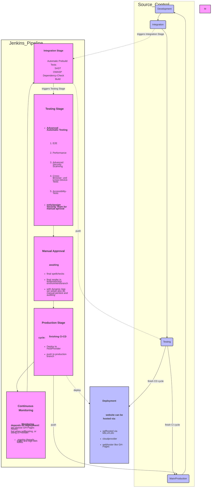

# My Website
- fresh blogs and stuff

## CI-CD Pipeline

```mermaid
graph TB
    subgraph "Source_Control"

        D(Development)
        I(Integration)
        T(Testing)
        M(Main/Production)
    end

classDef JP fill:#fffff,stroke:#333,stroke-width:2px,font-size:30px,text-align:left,margin-right: 450px;
classDef GH fill:#Fffff,stroke:#9999,stroke-width:2px,font-size:30px,text-align:left,margin-right: 350px;

    subgraph "Jenkins_Pipeline"
		
	Integration[
	    <h4>Integration Stage</h4>
	     Automatic Prebuild Tests
	     SAST
             OWASP Dependency-Check
	     Build
	]
	Testing[
				<div style="text-align: center;margin-left: 15px">
				<h3>Testing Stage</h3>
				<ul style="text-align: left;list-style: square; line-height: 0.8;">
				<li><b>Advanced Automatic Testing</b></li>
				<ol style="">
					<li>E2E</li>
					<li>Performance</li>
					<li>Advanced Security Scanning</li>
					<li>Cross-Browser- und Cross-Device-Tests</li>
					<li>Accessibility-Tests</li>
				</ol>
				<li><b>notiy/assign Security Team for manual aproval</b></li>
				</ul>
				</div>
	]
	Manual_Approval[
		<div style="text-align: center; ">
		<h3>Manual Approval</h3>
		<div style="text-align:left; line-height: 0.5;">
		<b>awaiting </b>
		<ul style="text-align: left;list-style: square; margin-left: 15px; line-height: 0.8;">	
		<li>final spellchecks</li>
		<li>final render in testproduction environment/branch</li>
		<li>with dynamic App we would also do manual pentest and auditing</li>
			
] 
        Production[
		<div style="text-align: center; ">
		<h3>Production Stage</h3>
		<div style="text-align:left; line-height: 0.5;">
		<b>finishing CI-CD cycle:</b>
		<ul style="text-align: left;list-style: square; margin-left: 15px; line-height: 0.8;">	
		<li>Deploy to HostProvider</li>
        	<li>push to production branch</li>
		</ul>
                </div>
		</div>
		]
	Monitoring[
		<div style="text-align: center; ">
		<h3>Continuous Monitoring</h3>
		<div style="text-align:left; line-height: 0.5;">
		<b>Monitoring depends on deployment!</b>
		<br>we choose GH-Pages hoster,
		<br>but when selfhosting, or using a Provider:
		<ul>
		<li> monitor threads, traffic and logs with kafka.</li>
</ul>
		</div>
		</div>
		]

	end
	


	GH[
		<div style="text-align: center;">
		<h4>Deployment</h4>
		
		<b>website can be hosted via:</b>
		<ul style="text-align: left;list-style: square; margin-left: 15px; line-height: 0.8;">	
		<li>selfhosted via k8s,vm,etc</li>
		<li>cloudprovider</li>
		<li>webhoster like GH-Pages</li>
		</ul>
		</div>
  	]

	M --> D
	D --> I
	I --> T
	T --"finish CD cycle"--> GH
	T --"finish CI cycle"--> M 
	Integration -- "triggers Testing Stage"--> Testing
	
	I -. "triggers Integration Stage".-> Integration
    	Integration -. "push".-> T
      	Testing --> Manual_Approval
   	Manual_Approval --> Production 
       	Production -- "push"---> M
C[M];
    	Production -."deploy".-> GH
	Production -->Monitoring
	Monitoring -->Integration
    classDef default fill:#f9f,stroke:#333,stroke-width:2px;
    classDef branch fill:#bbf,stroke:#333,stroke-width:2px;
    classDef action fill:#0f0,stroke:#333,stroke-width:2px;
    classDef Manual_Approval fill:#00f,stroke:#333,stroke-width:2px;
    class P,I,T,GH,M,D branch
    class SECURITY,MANUAL_SECURITY action
	class Jenkins_Pipeline JP
	class Source_Control GH

```
